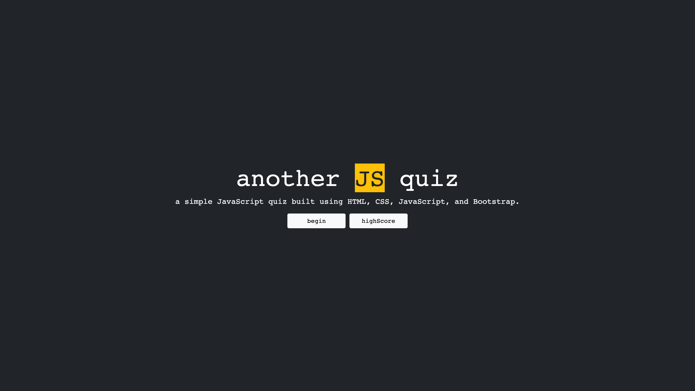

# JS-fundamentals-timed-quiz

## Purpose
To create an application that allows a user to take a timed quiz on JavaScript fundamentals that can store the highscores.

## Built With
* JavaScript
* CSS
* HTML

## Screenshot

## Website
https://travis2445.github.io/JS-fundamentals-timed-quiz/

## Contribution
Made with ❤️ by Travis2445